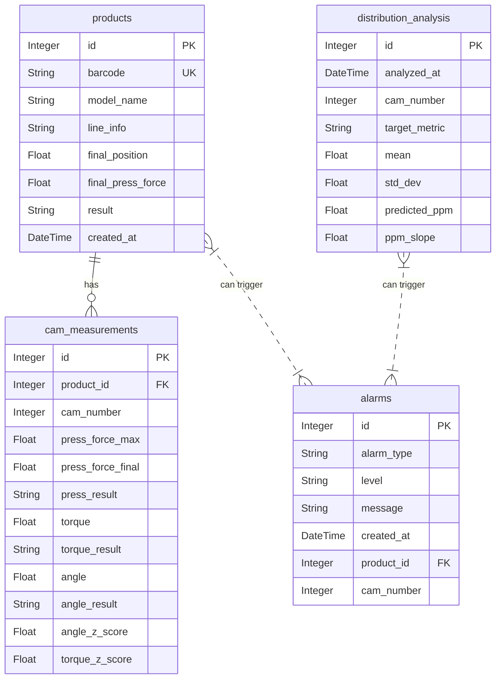

# 데이터베이스 스키마 설계서

## 1. 개요

본 문서는 캠샤프트 불량률 예측 시스템의 데이터베이스 스키마를 정의합니다. 데이터 모델은 정규화를 통해 데이터 중복을 최소화하고, 분석 및 조회 성능을 고려하여 설계되었습니다. `SQLAlchemy` ORM을 통해 모델을 관리하며, Oracle과 MariaDB 간의 호환성을 보장하는 데이터 타입을 사용합니다.

## 2. 테이블 스키마

### 2.1. `products` - 제품 정보

- **설명:** 생산된 각 제품의 기본 정보를 저장합니다. 데이터 파이프라인을 통해 원본 CSV에서 추출된 데이터가 저장됩니다.
- **컬럼 정의:**
  | 컬럼명 | 데이터 타입 (SQLAlchemy) | 데이터 타입 (Oracle) | 데이터 타입 (MariaDB) | 제약조건 | 설명 |
  | --- | --- | --- | --- | --- | --- |
  | `id` | `Integer` | `NUMBER(10)` | `INT` | `PK`, `Auto-increment` | 고유 식별자 |
  | `barcode` | `String(50)` | `VARCHAR2(50)` | `VARCHAR(50)` | `Unique`, `Not Null` | 제품 바코드 |
  | `model_name` | `String(50)` | `VARCHAR2(50)` | `VARCHAR(50)` | | 제품 모델명 |
  | `line_info` | `String(50)` | `VARCHAR2(50)` | `VARCHAR(50)` | | 라인/장비/팔레트 정보 |
  | `final_position` | `Float` | `FLOAT` | `FLOAT` | | 최종위치 (mm) |
  | `final_press_force`| `Float` | `FLOAT` | `FLOAT` | | 최종압입력 (kN) |
  | `result` | `String(10)` | `VARCHAR2(10)` | `VARCHAR(10)` | | 종합 판정 (OK/NG) |
  | `created_at` | `DateTime` | `TIMESTAMP` | `DATETIME` | `Not Null` | 생산 일시 |

### 2.2. `cam_measurements` - 캠샤프트 측정 데이터

- **설명:** 각 제품의 9개 캠별 측정치(압입력, 토크, 위상각 등)와 Z-score 분석 결과를 저장합니다. CSV의 wide-format 데이터를 long-format으로 변환하여 저장합니다.
- **컬럼 정의:**
  | 컬럼명 | 데이터 타입 (SQLAlchemy) | 데이터 타입 (Oracle) | 데이터 타입 (MariaDB) | 제약조건 | 설명 |
  | --- | --- | --- | --- | --- | --- |
  | `id` | `Integer` | `NUMBER(10)` | `INT` | `PK`, `Auto-increment` | 고유 식별자 |
  | `product_id` | `Integer` | `NUMBER(10)` | `INT` | `FK` to `products.id` | 제품 ID (외래키) |
  | `cam_number` | `Integer` | `NUMBER(2)` | `TINYINT` | `Not Null` | 캠 번호 (1-9) |
  | `press_force_max` | `Float` | `FLOAT` | `FLOAT` | | 최고 압입력 (kN) |
  | `press_force_final`| `Float` | `FLOAT` | `FLOAT` | | 최종 압입력 (kN) |
  | `press_result` | `String(10)` | `VARCHAR2(10)` | `VARCHAR(10)` | | 압입 판정 (OK/NG) |
  | `torque` | `Float` | `FLOAT` | `FLOAT` | | 토크 측정값 (N.m) |
  | `torque_result` | `String(10)` | `VARCHAR2(10)` | `VARCHAR(10)` | | 토크 판정 (OK/NG) |
  | `angle` | `Float` | `FLOAT` | `FLOAT` | | 위상각 측정값 (도) |
  | `angle_result` | `String(10)` | `VARCHAR2(10)` | `VARCHAR(10)` | | 위상각 판정 (OK/NG) |
  | `angle_z_score` | `Float` | `FLOAT` | `FLOAT` | `Index` | 위상각에 대한 Z-score |
  | `torque_z_score` | `Float` | `FLOAT` | `FLOAT` | `Index` | 토크에 대한 Z-score |

### 2.3. `distribution_analysis` - 공정 분석 결과

- **설명:** 일정 주기로 계산되는 공정의 통계적 분석 결과를 시계열로 저장합니다. **예측 모델의 핵심 데이터 테이블**입니다.
- **컬럼 정의:**
  | 컬럼명 | 데이터 타입 (SQLAlchemy) | 데이터 타입 (Oracle) | 데이터 타입 (MariaDB) | 제약조건 | 설명 |
  | --- | --- | --- | --- | --- | --- |
  | `id` | `Integer` | `NUMBER(10)` | `INT` | `PK`, `Auto-increment` | 고유 식별자 |
  | `analyzed_at` | `DateTime` | `TIMESTAMP` | `DATETIME` | `Not Null`, `Index` | 분석 수행 시각 |
  | `cam_number` | `Integer` | `NUMBER(2)` | `TINYINT` | `Not Null` | 캠 번호 (1-9) |
  | `target_metric`| `String(20)`| `VARCHAR2(20)` | `VARCHAR(20)` | `Not Null` | 분석 대상 지표 (angle, torque) |
  | `mean` | `Float` | `FLOAT` | `FLOAT` | | 분석 기간 동안의 평균(μ) |
  | `std_dev` | `Float` | `FLOAT` | `FLOAT` | | 분석 기간 동안의 표준편차(σ) |
  | `predicted_ppm`| `Float` | `FLOAT` | `FLOAT` | `Index` | **예상 불량률 (PPM)** |
  | `ppm_slope` | `Float` | `FLOAT` | `FLOAT` | | **예상 불량률의 변화 기울기** |

### 2.4. `alarms` - 알람 이력

- **설명:** 발생한 모든 알람의 이력을 저장합니다.
- **컬럼 정의:**
  | 컬럼명 | 데이터 타입 (SQLAlchemy) | 데이터 타입 (Oracle) | 데이터 타입 (MariaDB) | 제약조건 | 설명 |
  | --- | --- | --- | --- | --- | --- |
  | `id` | `Integer` | `NUMBER(10)` | `INT` | `PK`, `Auto-increment` | 알람 고유 식별자 |
  | `alarm_type` | `String(50)` | `VARCHAR2(50)` | `VARCHAR(50)` | `Not Null` | 알람 종류 (e.g., 'Process Instability') |
  | `level` | `String(20)` | `VARCHAR2(20)` | `VARCHAR(20)` | `Not Null` | 알람 수준 (e.g., 'warning', 'attention') |
  | `message` | `String(255)` | `VARCHAR2(255)` | `VARCHAR(255)` | | 알람 메시지 |
  | `created_at` | `DateTime` | `TIMESTAMP` | `DATETIME` | `Not Null` | 알람 발생 시각 |
  | `product_id` | `Integer` | `NUMBER(10)` | `INT` | `FK` to `products.id` (optional) | 관련 제품 ID |
  | `cam_number`| `Integer` | `NUMBER(2)` | `TINYINT` | (optional) | 관련 캠 번호 |

## 3. 관계 다이어그램 (ERD)

